# Website Luyện Code Cho Sinh Viên Công Nghệ Thông Tin Trong Trường Đại Học - NEUCODE (ReactJS + FastAPI - 2023)

## Hướng dẫn triển khai
- Tạo file .env trong thư mục frontend. Đặt biến môi trường REACT_APP_URL = `localhost máy đang chạy`
- Tạo một tệp tin .env trong thư mục backend và đặt các biến môi trường sau:
```c
PRODUCTION_DATABASE_USER=tên_người_dùng_của_bạn
PRODUCTION_DATABASE_PASSWORD=mật_khẩu_của_bạn
PRODUCTION_DATABASE_HOST=địa_chỉ_host_của_bạn
PRODUCTION_DATABASE_PORT=cổng_postgres_của_bạn
PRODUCTION_DATABASE_NAME=tên_database_của_bạn
```
Đảm bảo bạn điền đúng thông tin kết nối PostgreSQL của mình vào các giá trị tương ứng của biến môi trường

## Demo giao diện
1. Giao diện đăng nhập
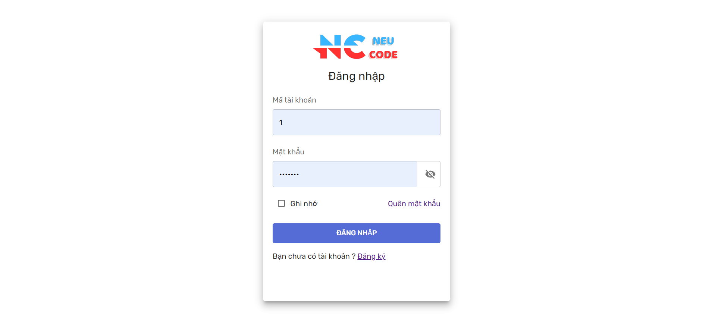
Vì hướng tới sinh viên và giảng viên trong trường đại học nên người dùng bắt buộc phải đăng nhập tài khoản của mình để vào trang web (làm thêm form đăng kí để dễ demo)

2. Giao diện trang chủ
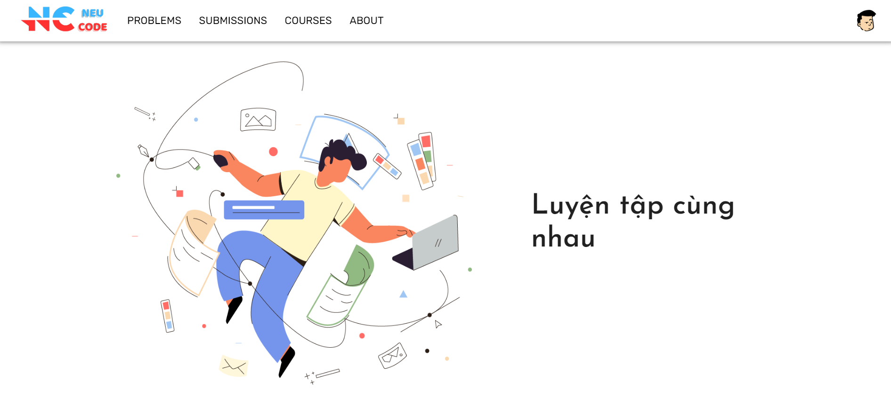
Vì hướng tới sinh viên và giảng viên trong trường đại học nên người dùng bắt buộc phải đăng nhập tài khoản của mình để vào trang web (làm thêm form đăng kí để dễ demo)

3. Giao diện thông tin người dùng
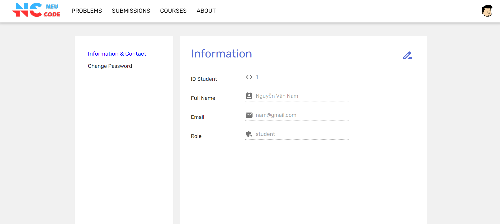
Trang này hiển thị những thông tin tài khoản của người dùng. Người dùng có thể ấn vào icon phía bên phải để cập nhật lại thông tin của mình

4. Giao diện đổi mật khẩu
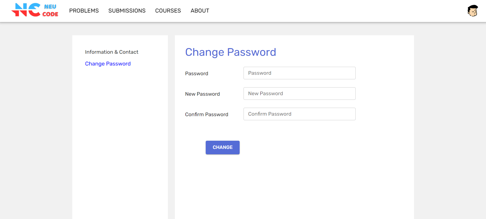
Trang này cho phép người dùng có thể thay đổi mật khẩu hiện tại thành một mật khẩu mới. Người dùng cần phải nhập chính xác mật khẩu cũ để xác nhận danh tính, nhập mật khẩu mới và xác nhận mật khẩu mới để đảm bảo tính xác thực

5. Giao diện làm bài
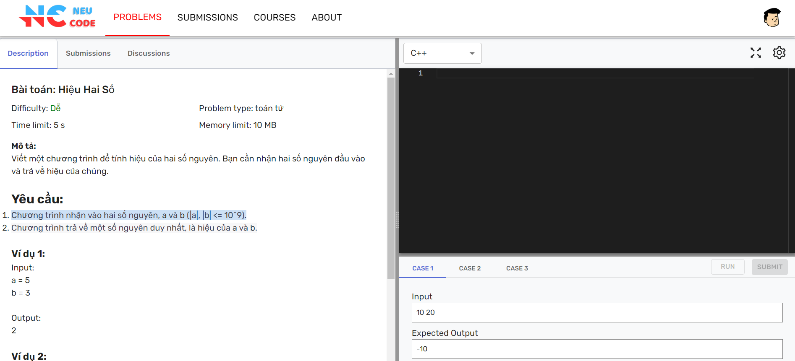
Đây là trang mà người dùng submit bài code lên hệ thống. Giao diện này có 2 nút **Run** và **Submit**. **Run** sẽ dùng cho trường hợp người dùng muốn chạy thử code xem đã chạy đúng chưa và **Submit** là khi người dùng muốn nộp bài lên hệ thống để hệ thống chấm điểm. 

6. Giao diện lịch sử kết quả bài làm của người dùng
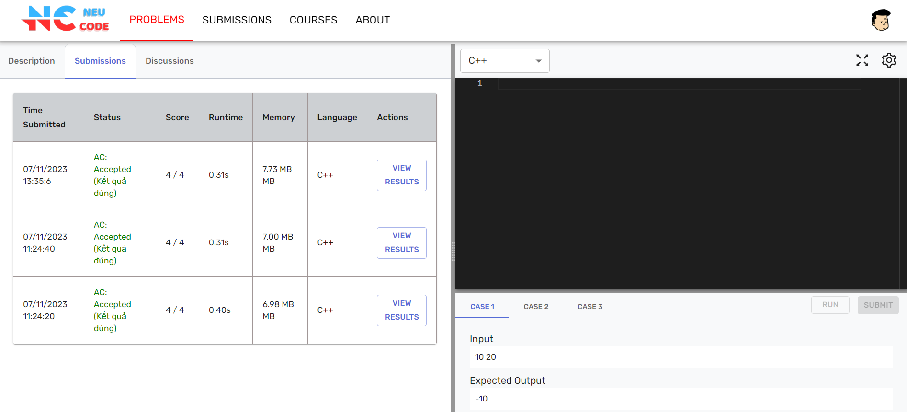
Giao diện này hiển thị lịch sử kết quả những bài làm trước đó của sinh viên đối với bài tập này

7. Giao diện hiện thị kết quả bài làm
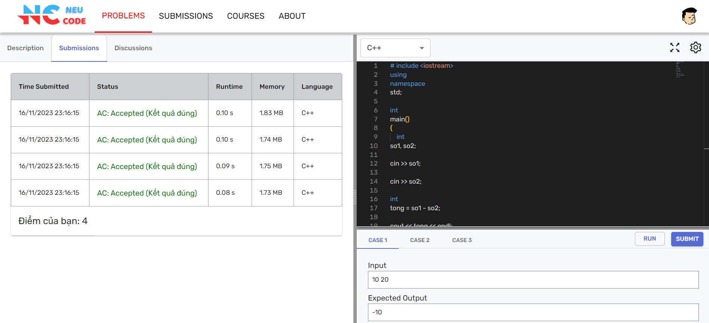
Giao diện này hiển thị kết quả bài làm của người dùng khi người dùng vừa submit nộp bài lên hệ thống

8. Giao diện bài tập (sinh viên)
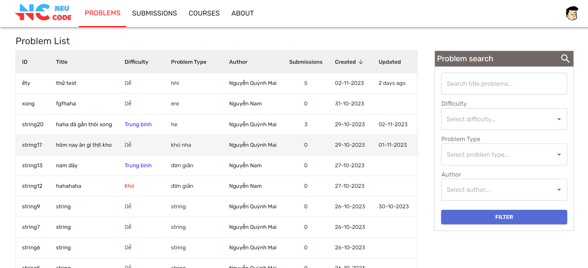
Trang Problems hiển thị danh sách những bài tập ở kho chung do giảng viên hay quản trị viên đăng lên. Đây là những bài mà sinh viên nào cũng có thể làm và gửi code lên để luyện khả năng lập trình. Sinh viên có thể tìm kiếm và lọc những bài tập 

9. Giao diện lịch sử bài nộp (sinh viên)
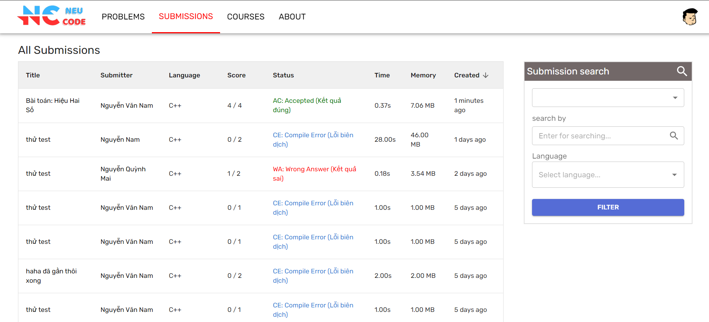
Trang Submissions hiển thị danh sách những bài nộp gần đây ở kho chung. Sinh viên có thể tìm kiếm và lọc những bài nộp theo ý mình

10. Giao diện lớp học phần (sinh viên)
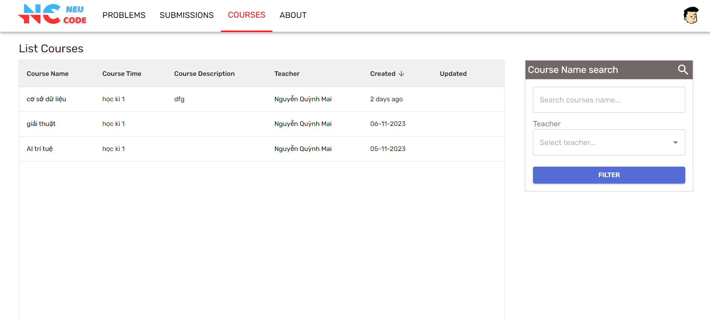
Trang Courses hiển thị danh sách những lớp học phần mà sinh viên tham gia và do giảng viên nào quản lý.

11. Giao diện bài tập trong lớp (sinh viên)
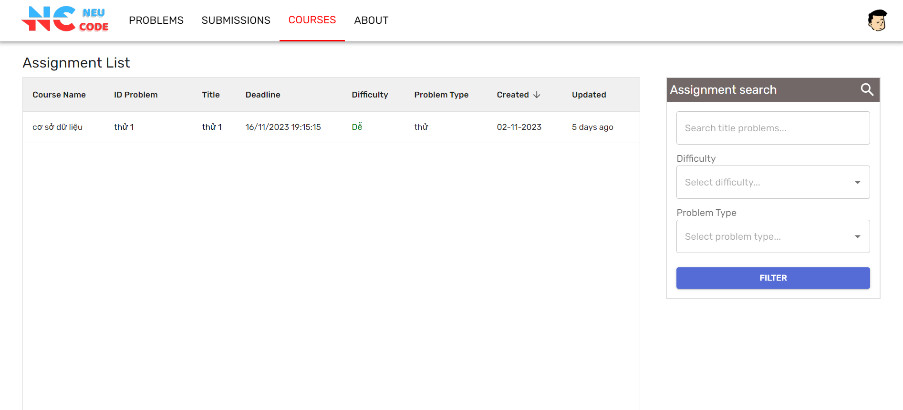
giao diện hiển thị danh sách những bài tập ở trong lớp học phần mà sinh viên tham gia. Đây là những bài mà sinh viên nào tham gia lớp học mới có thể làm và nộp bài. Những bài tập này đều có deadline nộp, nếu trễ deadline thì hệ thống sẽ không cho nộp nữa

12. Giao diện quản lý bài tập (giảng viên)
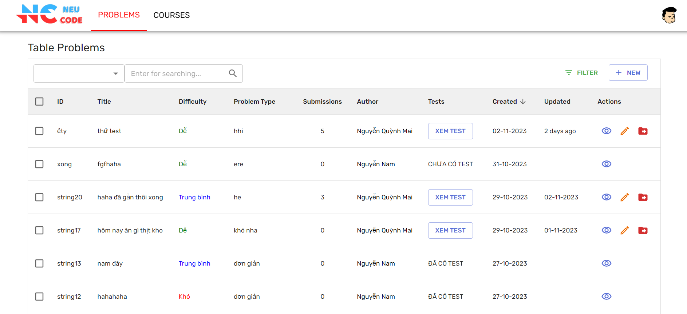
Trang Problems của giáo viên hiển thị thông tin những bài tập ở kho chung do giảng viên hay quản trị viên đăng lên. Giảng viên chỉ có thể thêm, sửa, xóa bài tập và thêm, sửa, xóa bộ test của những bài tập mà chính giảng viên đó đăng lên. Ngoài ra, giảng viên có thể chuyển những bài tập đó vào trong lớp học phần mà giảng viên đó đang quản lý

13. Giao diện quản lý lớp học phân (giảng viên)
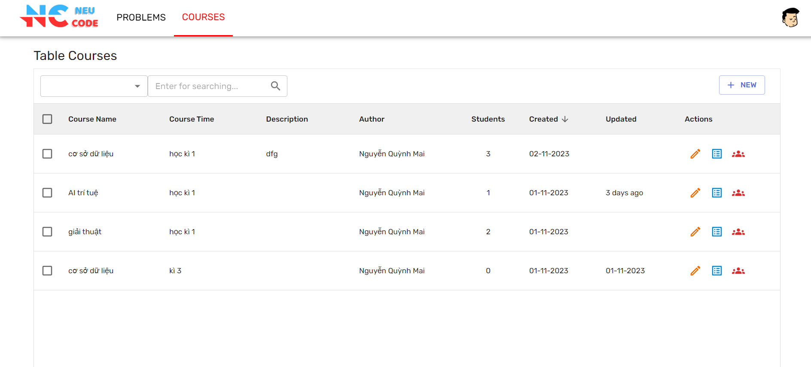
Trang Courses của giáo viên hiển thị thông tin những lớp học phần do giảng viên đó quản lý. Lớp học phần có thể do giảng viên tự tạo hay do quản trị viên tạo hộ. Giảng viên có thể sửa, xóa lớp học phần và tìm kiếm những lớp học phần theo ý mình

14. Giao diện quản lý bài tập trong lớp
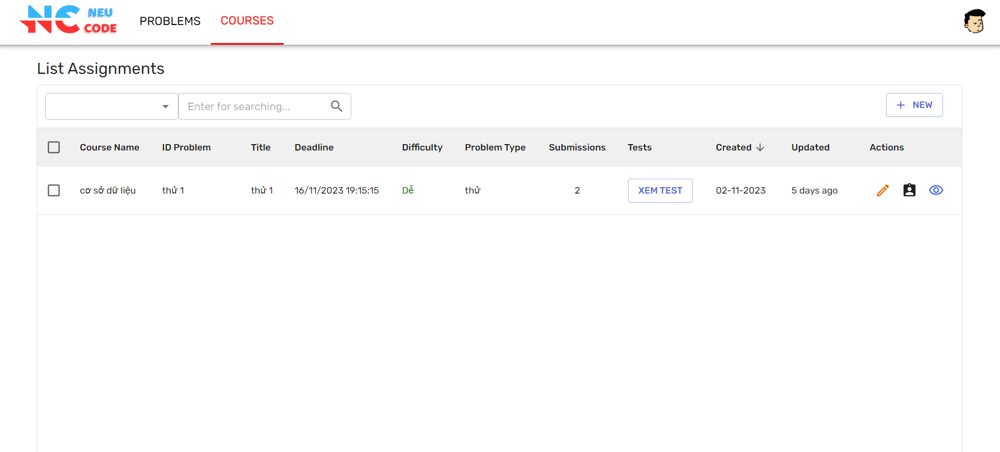
Giao diện hiển thị danh sách những bài tập trong lớp học phần. Giảng viên có thể thêm, sửa, xóa bài tập và thêm, sửa, xóa bộ test của những bài tập trong lớp. 
15. Giao diện quản lý sinh viên trong lớp (giảng viên)
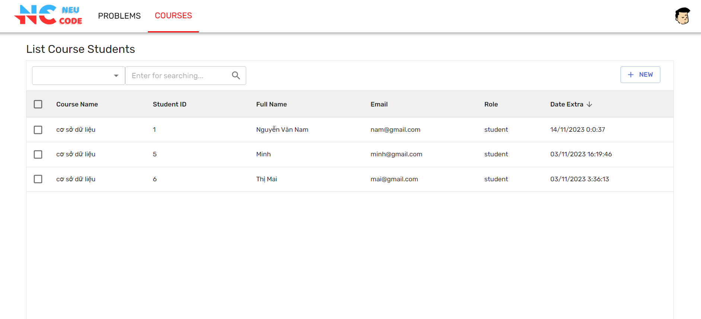
Giao diện hiển thị danh sách sinh viên trong lớp học phần. Giảng viên sẽ là người thêm sinh viên vào trong lớp. Giảng viên có thể thêm, xóa sinh viên trong lớp

16. Giao diện quản trị
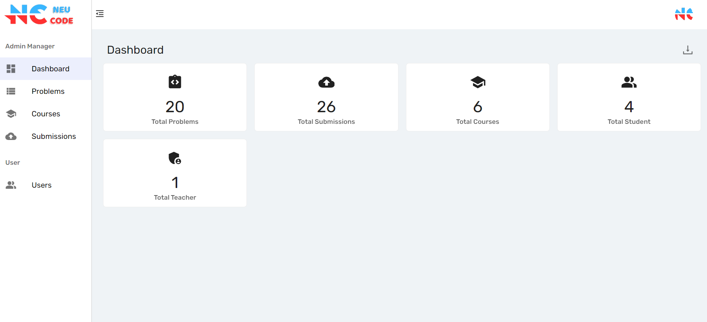
Trang dashboard của quản trị viên hiển thị những số liệu cần thiết của trang web 

17. Giao diện quản lý bài tập (admin)
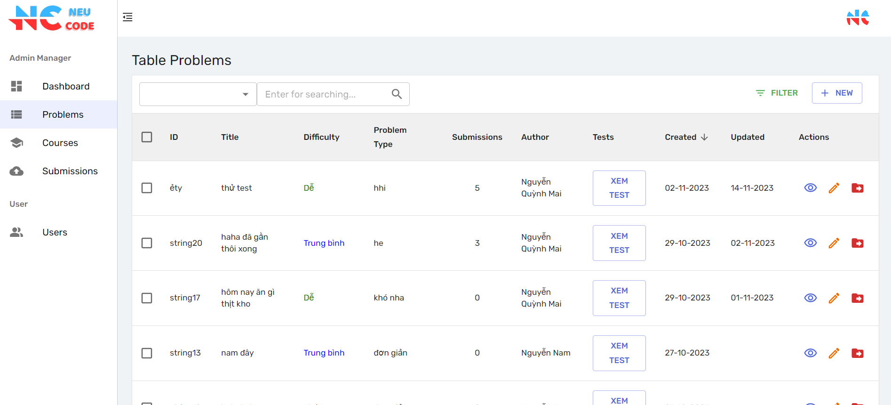
Trang Problems của quản trị viên hiển thị thông tin những bài tập ở kho chung. Quản trị viên có thể thêm, sửa, xóa bài tập và thêm, sửa, xóa bộ test của tất cả những bài tập. Ngoài ra, quản trị viên còn có thể chuyển những bài tập đó vào trong bất kì lớp học phần nào.

18. Giao diện quản lý lớp học phần (admin)
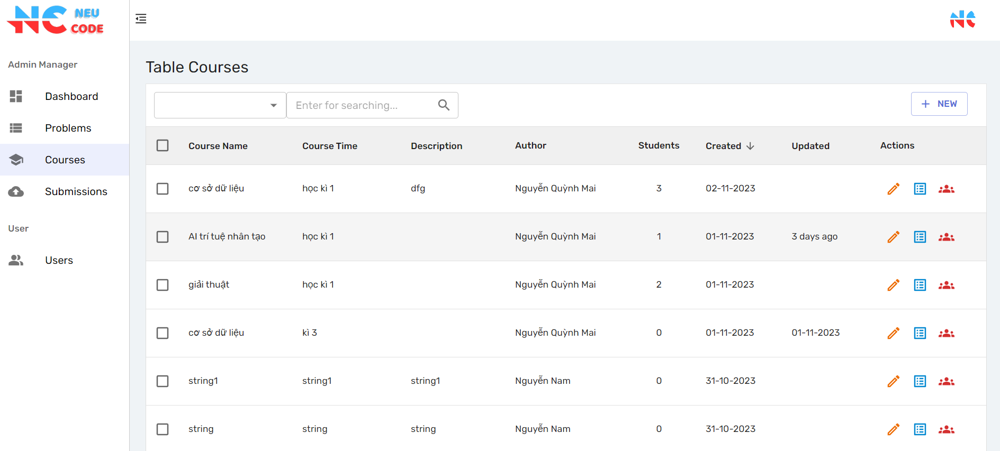
Trang Courses của quản trị viên hiển thị thông tin toàn bộ những lớp học phần trên hệ thống. Quản trị viên có thể tạo lớp cho mình hoặc có thể tạo lớp cho giáo viên bất kì. Quản trị viên viên có thể sửa, xóa lớp học phần và tìm kiếm những lớp học phần theo ý mình

19. Giao diện lịch sử bài nộp
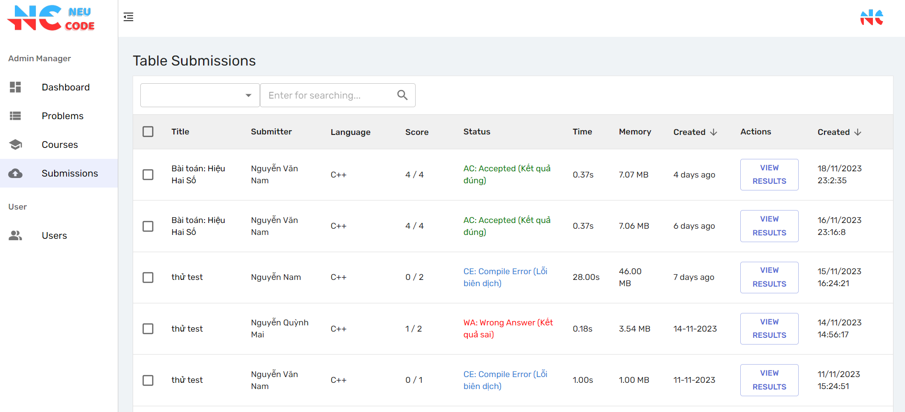
Trang Submissions của quản trị viên hiện thông tin tất cả những bài nộp trong hệ thống. Quản trị viên có thể xóa bất kì bài nộp nào trên hệ thống

20. Giao diện quản lý người dùng
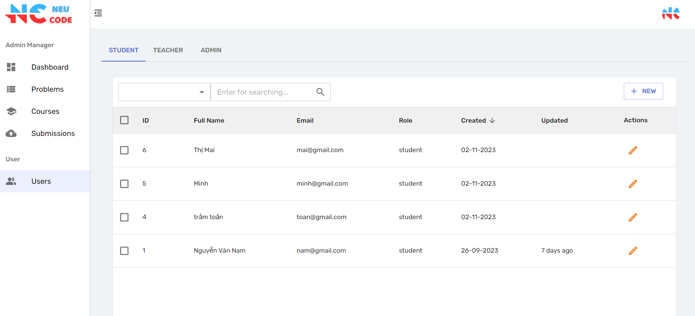
Trang Users của quản trị viên hiển thị tất cả những người dùng đang có trong hệ thống. Quản trị viên viên có thể thêm, sửa, xóa người dùng bất kì.
